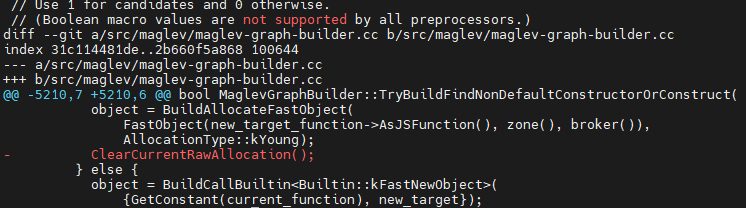

# Introduction
In this blog, we look into a vulnerability in Chrome V8, CVE-2024-0517. This vulnerability occurs when Maglev, the JIT compiler of V8, compiles a class that has a parent class. <br>
Since I'm a beginner in the cybersecurity field and this is my first time analyzing a 1-day exploit, I had a lot of difficulty understanding it. Therefore, I'll explain this vulnerability step by step. <br>

# Environment Configuration
The version that I used is as follows:
[chrome v8 12.0.267.15](https://chromium.googlesource.com/v8/v8.git/+/e73f620c2ef1230ddaa61551706225821a87c3b9) <br>

```javascript
# install depot_tools
cd ~
git clone https://chromium.googlesource.com/chromium/tools/depot_tools.git
export PATH=$HOME/depot_tools:$PATH
echo 'export PATH=$HOME/depot_tools:$PATH' >> ~/.zshrc

# get V8
cd ~
fetch v8
cd v8
git checkout e73f620c2ef1230ddaa61551706225821a87c3b9
gclient sync -D

# build V8
./build/install-build-deps.sh
gn gen out/debug --args='v8_no_inline=true v8_optimized_debug=false is_component_build=false v8_expose_memory_corruption_api=true'
ninja -C out/debug d8
./tools/dev/gm.py x64.release

# install gdb plugin
echo 'source ~/v8/tools/gdbinit' >> ~/.gdbinit
```

# Preliminary Knowledge
3. 사전 지식 <br>

# The Vulnerability
4. 취약점 <br>

This vulnerability was patched in version 12.0.267.16. You can verify this using **"git diff"**. <br>

```
git diff fbc4963bbff79ae2ef36821f870295f488cb497b e73f620c2ef1230ddaa61551706225821a87c3b9
```
 <br>
 <br>
# Vulnerability Exploitation Flow
5. 취약점 흐름 <br>

# Exploitation
6. exploit 전체 과정 요약 <br>

## Triggering the Vulnarability

## Exploit primitives
7. exploit primitives <br>

### addrof

### write

## Bypass ubercage with WebAssembly
8. WebAssembly <br>

### Shellcode Smuggling

### RIP control

### Running Shellcode
9. exploit 시연 <br>

# Conclusion
10. 내가 이 글을 쓰는 목표한 바, 어떤 취약점이였는지 총정리 <br>


